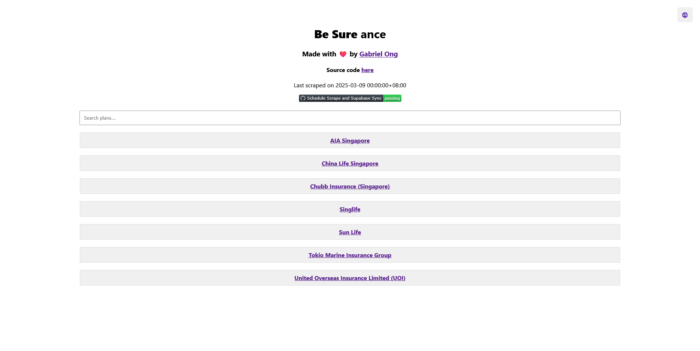
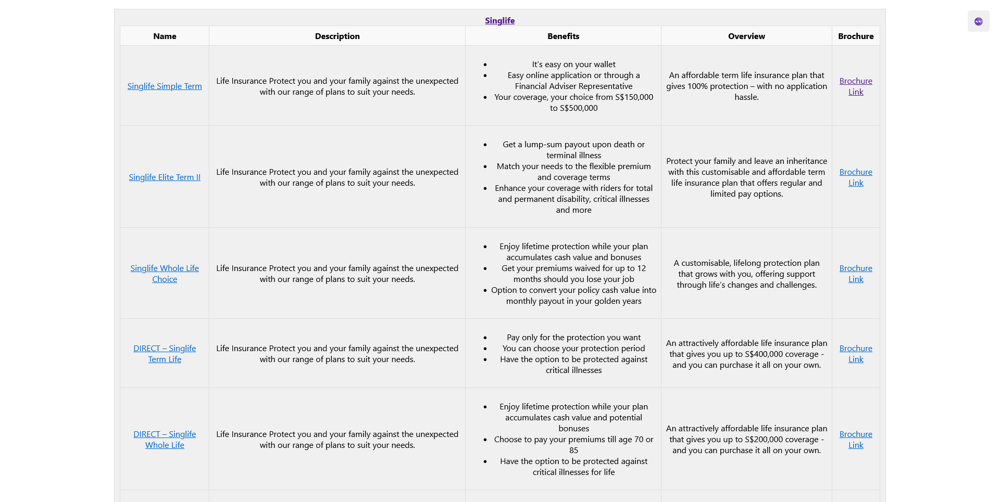
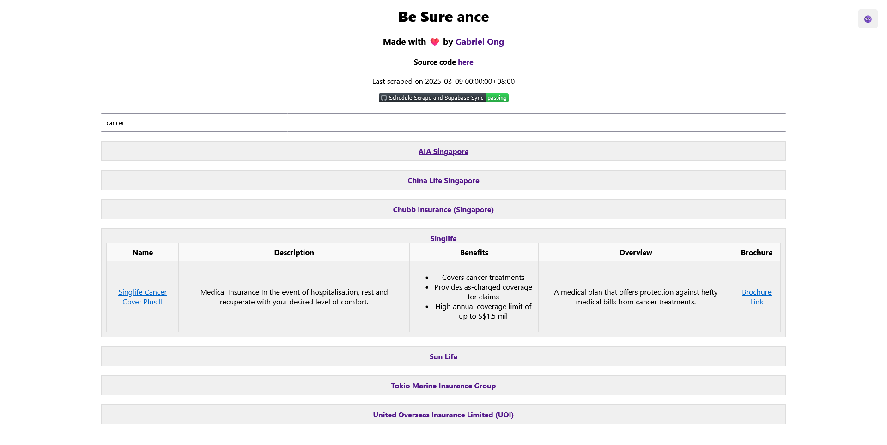
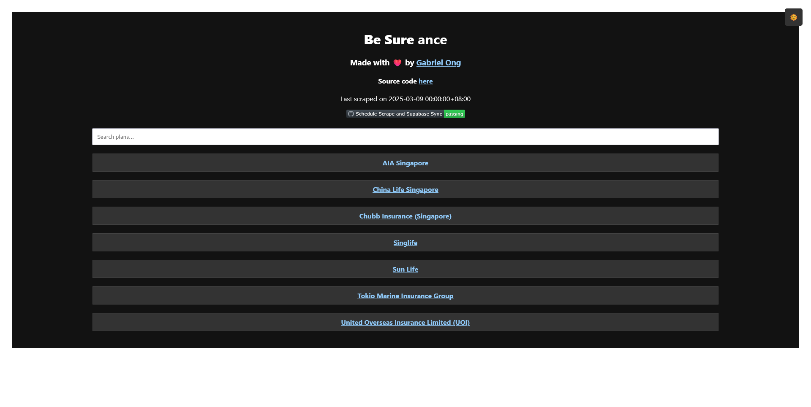
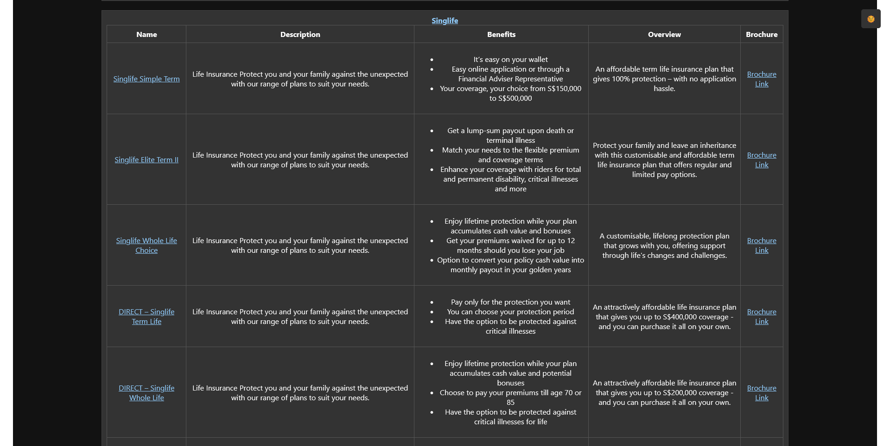
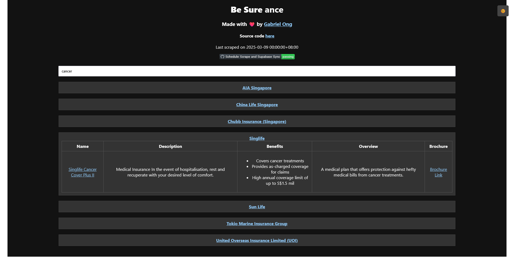
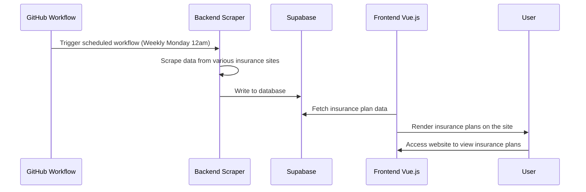
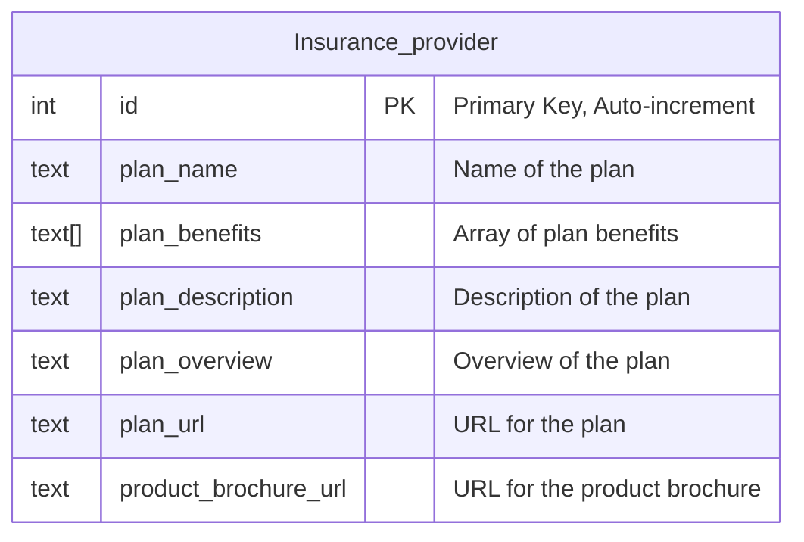

# `Be-sure-ance` 🤷‍♂️

Choosing an insurance plan should be easy. 

## Usage

Use the live website [***here***](https://be-sure-ance.netlify.app/).

Sites are scraped weekly on [SGT Monday 12am](./.github/workflows/scrape-to-supabase.yml).

> [!IMPORTANT]  
> Read the [legal disclaimer](#legal-disclaimer) before using `Be-sure-ance`.  

## Screenshots

  
  

 

  
  

 

  
  

## Architecture

### Stack

* [Frontend](./src/be-sure-ance-app/) - Vue.js, Netlify
* [Backend](./src/scrapers/) - Python, Github workflows
* [Database](./src/lib/create.sql) - Supabase

### Overview

### DB

## Details

`Be-sure-ance` supports the following Singaporean Insurance Providers. 

| Provider | Implementation Status | Implementation Date |
| :--- | :--- | :--- |
| [AIA Singapore Pte Ltd](https://www.aia.com.sg/en/index) | ✅ | 08/03/2025 |
| [Allianz Insurance (Singapore) Pte Ltd](https://www.allianz.sg/) | ❌ | | 
| [China Life Insurance (Singapore) Pte Ltd](https://www.chinalife.com.sg/) | ✅ | 12/03/2025 |
| [China Taiping Insurance (Singapore) Pte Ltd](https://www.sg.cntaiping.com/en/) | ❌ || 
| [Chubb Singapore Pte Ltd](https://www.chubb.com/sg-en/) | ✅ | 13/03/2025 | 
| [FWD Singapore Pte Ltd](https://www.fwd.com.sg/) | ❌ || 
| [Great Eastern Life Assurance Co Ltd](https://www.greateasternlife.com/sg/en/about-us.html) | ✅ | 15/03/2025 |
| [HSBC Life (Singapore) Pte Ltd](https://www.insurance.hsbc.com.sg/) | ✅ | 15/03/2025 |
| [Manulife (Singapore) Pte Ltd](https://www.manulife.com.sg/) | ❌ || 
| [Prudential Assurance Company (Singapore) Pte Ltd](https://www.prudential.com.sg/) | ❌ || 
| [Raffles Health Insurance Pte Ltd](https://www.raffleshealthinsurance.com/) | ❌ || 
| [Singapore Life Ltd](https://singlife.com/en) | ✅ | 13/03/2025 | 
| [Sun Life Assurance Company of Canada Singapore Branch](https://www.sunlife.com.sg/en/) | ✅ | 13/03/2025 | 
| [Allied World Assurance Company Pte Ltd (Singapore)](https://alliedworldinsurance.com/singapore/) | ❌ || 
| [Auto & General Insurance (Singapore) Pte Ltd](https://www.aig.sg/home) | ❌ || 
| [ERGO Insurance Pte Ltd](https://www.ergo.com.sg/) | ❌ || 
| [Etiqa Insurance Pte Ltd](https://www.etiqa.com.sg/) | ❌ || 
| [HL Assurance Pte Ltd](https://www.hlas.com.sg/) | ❌ || 
| [Income Insurance Pte Ltd](https://www.income.com.sg/) | ❌ || 
| [India International Insurance Pte Ltd](https://www.iii.com.sg/) | ✅ | 15/03/2025 |
| [Liberty Insurance Pte Ltd](https://www.libertyinsurance.com.sg/) | ❌ || 
| [Lonpac Insurance Bhd](https://www.lonpac.com/) | ❌ || 
| [QBE Insurance (Singapore) Pte Ltd](https://www.qbe.com/sg) | ❌ || 
| [Sompo Insurance (Singapore) Pte Ltd](https://www.sompo.com.sg/) | ❌ || 
| [Tokio Marine Insurance (Singapore) Pte Ltd](https://www.tokiomarine.com/sg/en.html) | ✅ | 13/03/2025 | 
| [United Overseas Insurance Pte Ltd](https://www.uoi.com.sg/index.page) | ✅ | 08/03/2025 | 
| [Direct Asia Insurance (Singapore) Pte Ltd](https://www.directasia.com/) | ❌ || 

## Issues

Report any issues to [gabrielzmong@gmail.com](mailto:gabrielzmong@gmail.com).

## Legal disclaimer

### For Informational Purposes Only

The information provided on Be-sure-ance is for general informational purposes only. While we strive to ensure the accuracy and reliability of the insurance plans displayed, Be-sure-ance makes no guarantees, representations, or warranties of any kind, express or implied, about the completeness, accuracy, reliability, suitability, or availability of the information. Users should independently verify any information before making decisions based on it.

### No Professional Advice

Be-sure-ance does not provide professional, legal, financial, or insurance advice. The content displayed should not be considered as a substitute for professional advice from licensed insurance agents or advisors. Users are encouraged to consult directly with the relevant insurance companies or professionals to confirm details and suitability of any insurance plans.

### No Endorsement

The inclusion of any insurance plans or companies on Be-sure-ance does not constitute an endorsement or recommendation of their services. Be-sure-ance is not affiliated with any of the listed insurance providers unless explicitly stated otherwise.

### Third-Party Content

Be-sure-ance may display information sourced from third-party providers or link to external websites. We do not control, monitor, or guarantee the accuracy or reliability of such third-party content. Accessing third-party links is at your own risk, and Be-sure-ance is not responsible for any content, claims, or damages resulting from their use.

### Use at Your Own Risk

Users access and use Be-sure-ance at their own risk. Be-sure-ance disclaims all liability for any loss or damage, direct or indirect, arising from reliance on the information provided on this platform. This includes but is not limited to financial loss, data inaccuracies, or decisions made based on the content displayed.

### Limitation of Liability

To the fullest extent permitted by law - 

* Be-sure-ance shall not be liable for any direct, indirect, incidental, consequential, or punitive damages arising out of your use of this web app.
* Be-sure-ance disclaims all liability for errors or omissions in the content provided.
* Our total liability under any circumstances shall not exceed the amount paid by you *(if any)* for using Be-sure-ance.

### Changes to Content

Be-sure-ance reserves the right to modify, update, or remove any content on this platform at any time without prior notice. Insurance plans and details may change without notice; users should contact the respective insurance companies for up-to-date information.

### Jurisdiction

This disclaimer and your use of Be-sure-ance shall be governed by and construed in accordance with the laws of Singapore. Any disputes arising out of or in connection with this disclaimer shall be subject to the exclusive jurisdiction of the courts in Singapore.