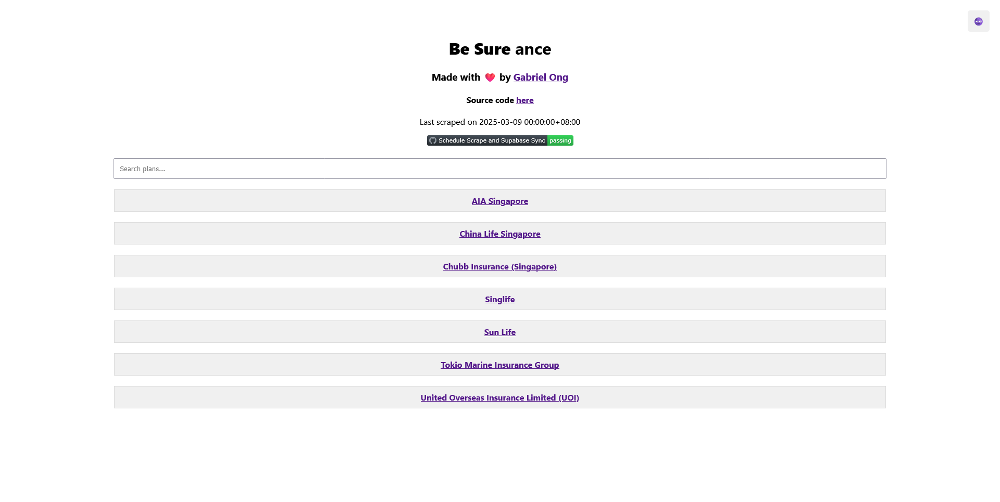
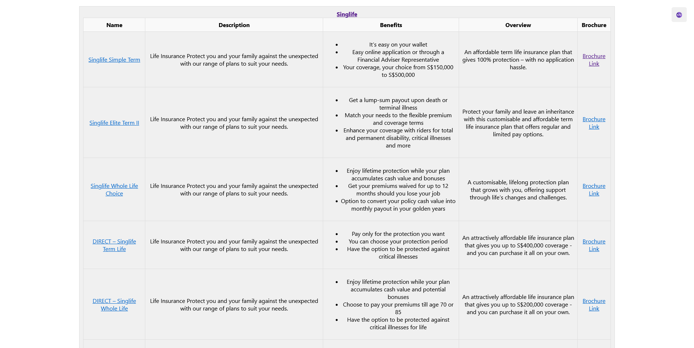
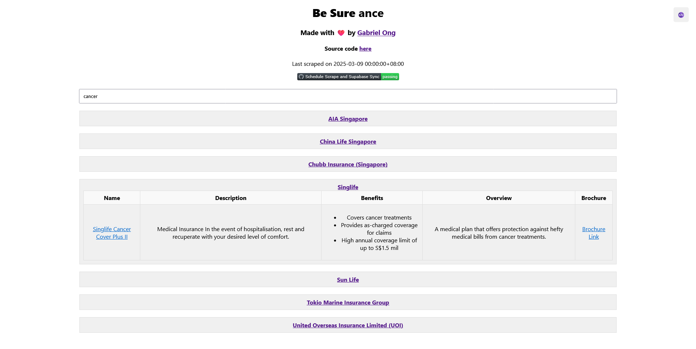
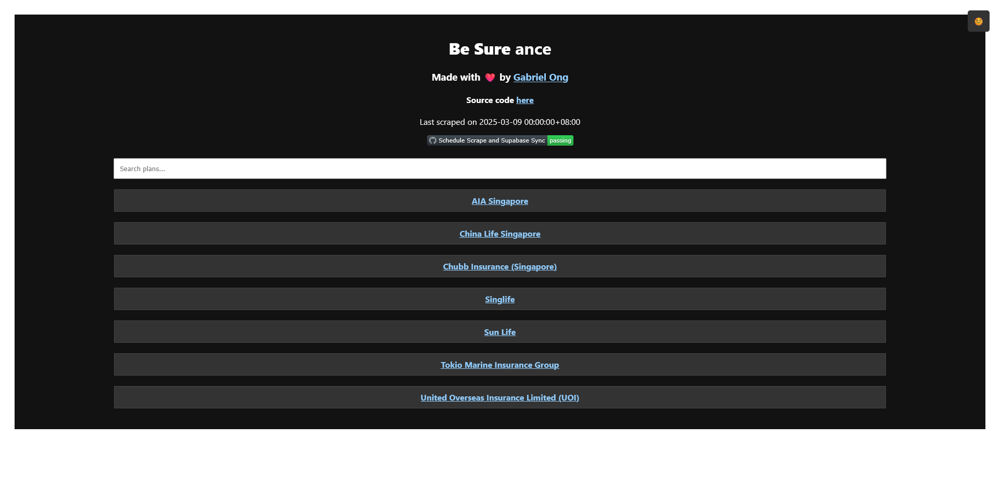
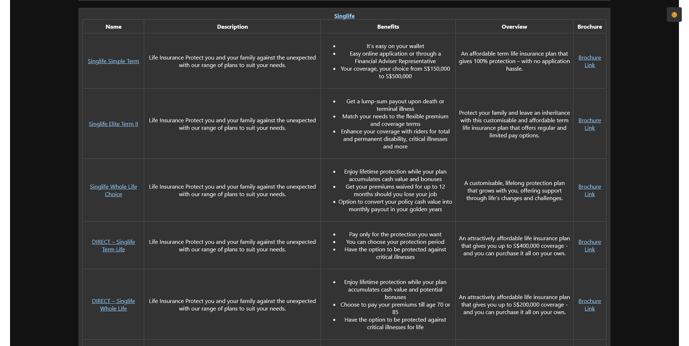
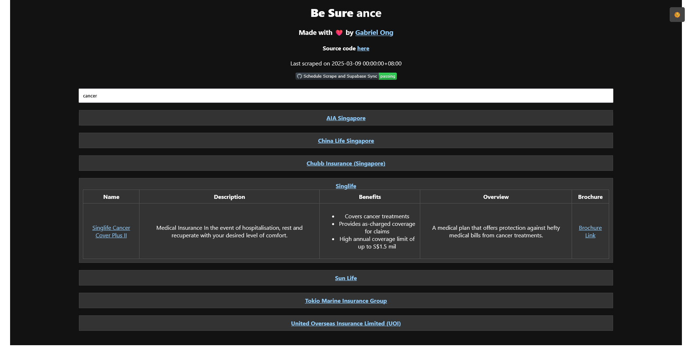
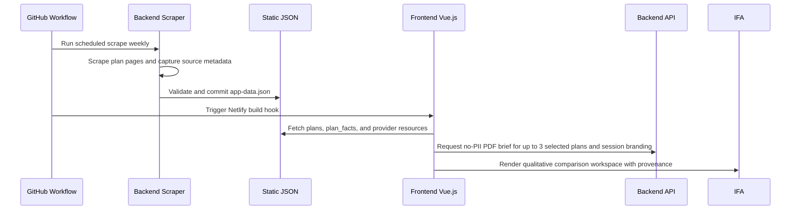
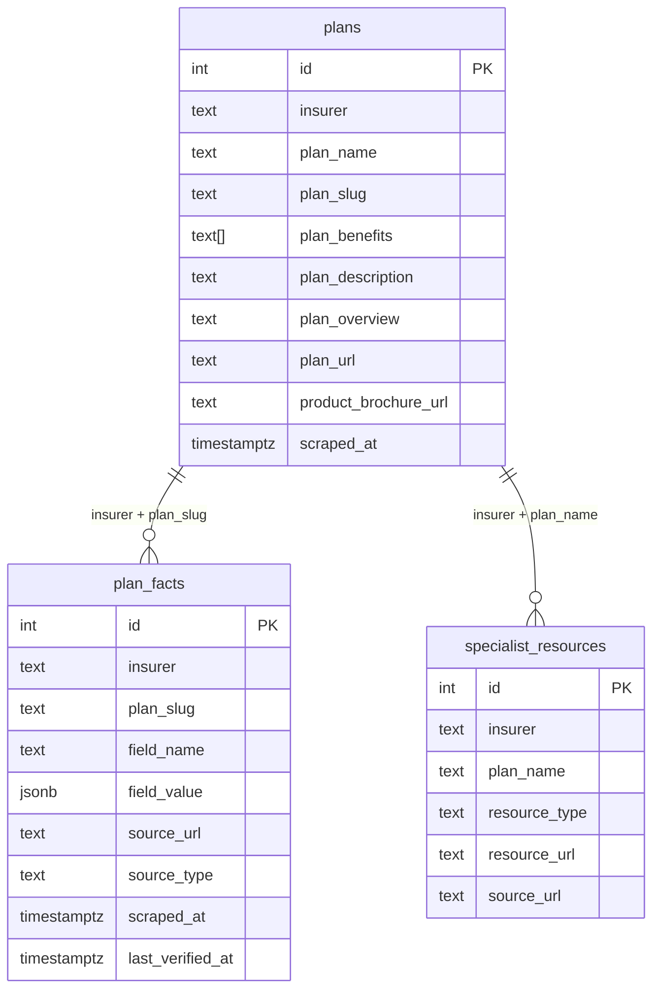

# `Be-sure-ance`

`Be-sure-ance` is a public-good IFA pre-meeting research tool for source-traceable qualitative metadata on Singapore insurance plans. [`compareFIRST`](https://www.comparefirst.sg/wap/homeEvent.action) remains the reference point for regulated quantitative life-insurance comparison; this project complements compareFIRST with plan-grain qualitative facts that it does not try to curate, such as panel/network clues, exclusions, claim process text, regulatory-event context, and brochure provenance.

The civic value is narrow: reduce brochure-by-brochure manual checking, make stale or changed source material visible, and keep qualitative plan facts traceable to public carrier, MOH, LIA, or MAS sources before any licensed advisory workflow starts. Be-sure-ance does not replace compareFIRST, carrier brochures, or licensed financial advisers.

The app does not provide financial advice, insurance advice, quotes, recommendations, suitability rankings, premium estimates, or cost projections. It is a research workspace for checking source-linked plan facts before using carrier documents, compareFIRST, or licensed advisory workflows.

## Portfolio status

| Signal | Current value | Evidence / caveat |
| :-- | :-- | :-- |
| Supported scheduled carriers | 19 | Test-backed from `src/scrapers/registry.py`; 8 more carriers remain experimental opt-in scrapers. |
| MOH institutions available for panel normalization | 5,305 | Latest local dry-run on 2026-07-02; production refresh still depends on Phase 5 deployment. |
| LIA claim metrics extracted | 12 | Latest local dry-run on 2026-07-02 against fixture/live parser path. |
| Civic carrier canonicalization | Available locally | MAS FID Insurance and LIA member-directory cross-checks produce source-backed canonical names and mismatch flags. |
| Open dataset snapshots | Artifact workflow | Weekly CC-BY-4.0 CSV artifacts export plan facts, source URLs, and verification dates. |
| WCAG 2.1 AA audit | 0 Axe violations / Lighthouse 100 | Local audit on 2026-07-02 covered `/`, `/matrix/panel-hospitals`, `/status`, and one `/share?plans=<refs>` route. See [docs/ACCESSIBILITY.md](./docs/ACCESSIBILITY.md). |
| 30-day lookups | Unavailable | No production Plausible/Umami/privacy-safe analytics deployment is claimed during Phases 1-4. |
| Brochure alerts fired | Unavailable | Brochure history and pending-alert rows exist; no production alert dispatcher is claimed before Phase 5. |

OGP/GovTech tooling scope: Postman.gov.sg email alerts, FormSG stale-data reports, and Go.gov.sg short links were evaluated in [ADR 0007](./docs/adr/0007-defer-ogp-tooling-integrations.md). No integration is currently claimed; each is deferred until public-sector ownership, access, and governance are confirmed.

Cost posture: `$0/mo` target during portfolio validation on Netlify or Cloudflare Pages free tier plus GitHub Actions free tier. Any paid upgrade should be documented here before launch.

## Open source

This repository is MIT licensed. Read [CONTRIBUTING.md](./CONTRIBUTING.md) before changing scrapers, data contracts, compliance wording, or deployment assumptions. Participation is governed by [CODE_OF_CONDUCT.md](./CODE_OF_CONDUCT.md).

Architecture decisions are recorded in [docs/adr](./docs/adr/).

Portfolio artifacts:

- [Accessibility audit](./docs/ACCESSIBILITY.md)
- [Compliance posture](./docs/COMPLIANCE.md)
- [Data model](./docs/DATA_MODEL.md)
- [Takedown runbook](./docs/TAKEDOWN_RUNBOOK.md)
- [Succession runbook](./docs/SUCCESSION.md)
- [Post-launch operations](./docs/OPERATIONS.md)
- [Phase 4 exit verification](./docs/PHASE4_EXIT_VERIFICATION.md)
- [Phase 5 exit verification](./docs/PHASE5_EXIT_VERIFICATION.md)
- [Launch pre-flight runbook](./docs/LAUNCH_PREFLIGHT.md)
- [Deployment runbook](./docs/DEPLOYMENT.md)
- [Search indexing runbook](./docs/SEARCH_INDEXING.md)
- [Launch outreach drafts](./docs/OUTREACH.md)
- [Pivot blog draft](./docs/blog/why-we-ripped-out-regex-derived-premiums.md)
- [Case study template](./docs/case-studies/)
- [Talk proposal](./docs/talks/)

## Usage

No production deployment is claimed during Phases 1-4. Phase 5 is the launch gate for restoring Netlify or moving to another static host.
Deployment decision: restore Netlify first; see [deployment runbook](./docs/DEPLOYMENT.md). Production URL is not published from this repository yet.
Before any public launch, run the [launch pre-flight](./docs/LAUNCH_PREFLIGHT.md) workflow against staging and record compliance sign-off status.

Sites are refreshed weekly on [SGT Monday 12am](./.github/workflows/refresh-static-data.yml). The scheduled workflow scrapes in GitHub Actions, validates and commits `public/data/app-data.json`, then triggers the Netlify build hook.
The public scraper health dashboard is available at `/status` after the app is deployed.

> [!IMPORTANT]
> Read the [compliance posture](./docs/COMPLIANCE.md) and [legal disclaimer](#legal-disclaimer) before using `Be-sure-ance`.

## Local Docker demo

Run the no-credential local demo:

```sh
docker compose up --build
```

Open `http://localhost:5173`. The default stack starts the Vue frontend and FastAPI PDF backend, then generates seeded static app data. It does not require production credentials and does not deploy anything.

Common local commands:

```sh
docker compose run --rm scraper
PYTHON=.venv/bin/python npm --prefix src/be-sure-ance-app run scrape:data:smoke
PYTHON=.venv/bin/python npm --prefix src/be-sure-ance-app run build:local
TELEGRAM_BOT_TOKEN=<bot-token> docker compose --profile bot up bot
docker compose down --volumes
```

Keep `TELEGRAM_BOT_TOKEN` and any observability credentials in local `.env` files or GitHub Actions secrets, not in `docker-compose.yml`.

## Environment variables

Use [`.env.example`](./.env.example) as the local template.

Frontend variables are public and are bundled into the Vue app:

```sh
VITE_STATIC_DATA_PATH=/data/app-data.json
VITE_PDF_BRIEF_ENDPOINT=/briefs/client.pdf
VITE_SITE_ORIGIN=
```

Scraper/backend variables are private and must stay in local `.env` or GitHub Actions secrets:

```sh
BE_SURE_ANCE_DATA_DIR=src/be-sure-ance-app/public/data
NETLIFY_BUILD_HOOK_URL=
TELEGRAM_BOT_TOKEN=
SENTRY_DSN=
SENTRY_ENVIRONMENT=local
SENTRY_RELEASE=
SENTRY_TRACES_SAMPLE_RATE=0
```

Netlify only needs `VITE_STATIC_DATA_PATH`, `VITE_SITE_ORIGIN`, optional `VITE_PDF_BRIEF_ENDPOINT`, and optional `VITE_SENTRY_*` variables for frontend-only error reporting.

GitHub Actions uses `NETLIFY_BUILD_HOOK_URL` after a valid static-data refresh. The Telegram worker requires `TELEGRAM_BOT_TOKEN`. Scraper observability is optional through `SENTRY_DSN`. Never expose `SENTRY_DSN` or `TELEGRAM_BOT_TOKEN` through `VITE_*` variables.

## Local checks

```sh
python3 -m pip install -r requirements.txt
black --check src tests
ruff check src tests
python3 -m unittest discover -s tests -p "test_*.py"
npm --prefix src/be-sure-ance-app ci
npm --prefix src/be-sure-ance-app run lint
npm --prefix src/be-sure-ance-app run format:check
(cd src/be-sure-ance-app && VITE_STATIC_DATA_PATH=/data/app-data.json VITE_SITE_ORIGIN=https://example.com npm run build)
pre-commit run --all-files
uvicorn src.backend.pdf_brief_api:app --reload
```

The FastAPI backend exposes the no-PII PDF endpoint for local development. Production PDF export is served by the Netlify Function at `/briefs/client.pdf`. Share links encode only selected `{insurer, plan_slug}` references in the URL and are not persisted server-side.

Telegram lookup beta:

```sh
python3 -m src.bot.telegram_bot
```

See [Telegram bot beta](./docs/TELEGRAM_BOT.md) for token handling, commands, and deployment notes.

## Static plan pages and sitemap

`npm run build` uses the committed `public/data/app-data.json`, runs Vite, then generates `dist/plan/<insurer>/<plan-slug>/index.html`, `dist/sitemap.xml`, and `dist/robots.txt`. The static page generator reads `plans` and `plan_facts` from the same app-data JSON used by the browser.

Set `VITE_SITE_ORIGIN` to the canonical production origin before Phase 5 launch. Submit `<origin>/sitemap.xml` in Google Search Console and Bing Webmaster Tools only after deployment is restored.
Use [search indexing](./docs/SEARCH_INDEXING.md) to record sitemap pre-flight, Google submission, and Bing submission status.

## Screenshots

<div style="display: flex; justify-content: space-between;">
  
  
</div>
<br>
<div style="display: flex; justify-content: space-between;">
  
  
</div>
<br>
<div style="display: flex; justify-content: space-between;">
  
  
</div>

## Architecture

### Stack

* [Frontend](./src/be-sure-ance-app/) - Vue 3, Vite, static JSON app data, localStorage shortlist state, and URL-only share links.
* [Backend](./src/) - Python scrapers, local JSON table export, FastAPI local PDF endpoint, Netlify PDF Function, and Telegram lookup bot.
* [Static data](./src/lib/static_app_data.py) - build-time exporter for `public/data/app-data.json`.

### Overview


```mermaid
sequenceDiagram
    participant GitHub Workflow
    participant Backend Scraper
    participant Static JSON
    participant Frontend Vue.js
    participant Backend API
    participant IFA

    GitHub Workflow->>Backend Scraper: Run scheduled scrape weekly
    Backend Scraper->>Backend Scraper: Scrape plan pages and capture source metadata
    Backend Scraper->>Static JSON: Validate and commit app-data.json
    GitHub Workflow->>Frontend Vue.js: Trigger Netlify build hook
    Frontend Vue.js->>Static JSON: Fetch plans, plan_facts, and provider resources
    Frontend Vue.js->>Backend API: Request no-PII PDF brief for up to 3 selected plans and session branding
    Frontend Vue.js->>IFA: Render qualitative comparison workspace with provenance
```

### DB


```mermaid
erDiagram
    plans {
        int id PK
        text insurer
        text plan_name
        text plan_slug
        text[] plan_benefits
        text plan_description
        text plan_overview
        text plan_url
        text product_brochure_url
        timestamptz scraped_at
    }

    plan_facts {
        int id PK
        text insurer
        text plan_slug
        text field_name
        jsonb field_value
        text source_url
        text source_type
        timestamptz scraped_at
        timestamptz last_verified_at
    }

    specialist_resources {
        int id PK
        text insurer
        text plan_name
        text resource_type
        text resource_url
        text source_url
    }

    plans ||--o{ plan_facts : "insurer + plan_slug"
    plans ||--o{ specialist_resources : "insurer + plan_name"
```

`plans` is the canonical plan catalog. `plan_facts` is the canonical qualitative fact table; each displayed fact carries `source_url`, `source_type`, `scraped_at`, and `last_verified_at`. `plan_comparison_facts` remains an interim qualitative summary table while the frontend completes the Phase 2 migration.

## Details

`Be-sure-ance` only schedules supported scrapers by default. Generic scrapers are experimental, opt-in via `python -m src.scrapers.run_all --include-experimental --only <module>`, and deferred until Phase 2 golden-output tests exist.

| Provider | Runtime status | Decision |
| :--- | :--- | :--- |
| [AIA Singapore Pte Ltd](https://www.aia.com.sg/en/index) | Supported - scheduled | Implemented 08/03/2025 |
| [Allianz Insurance (Singapore) Pte Ltd](https://www.allianz.sg/) | Supported - scheduled | Promoted 06/07/2026 after live dry-run produced plan rows |
| [China Life Insurance (Singapore) Pte Ltd](https://www.chinalife.com.sg/) | Supported - scheduled | Implemented 12/03/2025 |
| [Chubb Singapore Pte Ltd](https://www.chubb.com/sg-en/) | Supported - scheduled | Implemented 13/03/2025 |
| [Etiqa Insurance Pte Ltd](https://www.etiqa.com.sg/) | Supported - scheduled | Promoted 05/07/2026 after static scraper live dry-run produced plan rows |
| [FWD Singapore Pte Ltd](https://www.fwd.com.sg/) | Supported - scheduled | Promoted 05/07/2026 after live dry-run produced plan rows |
| [Great Eastern Life Assurance Co Ltd](https://www.greateasternlife.com/sg/en/about-us.html) | Supported - scheduled | Implemented 15/03/2025 |
| [HL Assurance Pte Ltd](https://www.hlas.com.sg/) | Supported - scheduled | Promoted 06/07/2026 after static scraper live dry-run produced plan rows |
| [HSBC Life (Singapore) Pte Ltd](https://www.insurance.hsbc.com.sg/) | Supported - scheduled | Implemented 15/03/2025 |
| [India International Insurance Pte Ltd](https://www.iii.com.sg/) | Supported - scheduled | Implemented 15/03/2025 |
| [Income Insurance Pte Ltd](https://www.income.com.sg/) | Supported - scheduled | Promoted 05/07/2026 after static scraper live dry-run produced plan rows |
| [Manulife (Singapore) Pte Ltd](https://www.manulife.com.sg/) | Supported - scheduled | Promoted 05/07/2026 after live dry-run produced plan rows |
| [Prudential Assurance Company (Singapore) Pte Ltd](https://www.prudential.com.sg/) | Supported - scheduled | Promoted 05/07/2026 after live dry-run produced plan rows |
| [Raffles Health Insurance Pte Ltd](https://www.raffleshealthinsurance.com/) | Supported - scheduled | Promoted 05/07/2026 after live dry-run produced plan rows |
| [Singapore Life Ltd](https://singlife.com/en) | Supported - scheduled | Implemented 13/03/2025 |
| [Sompo Insurance (Singapore) Pte Ltd](https://www.sompo.com.sg/) | Supported - scheduled | Promoted 06/07/2026 after static scraper live dry-run produced plan rows |
| [Sun Life Assurance Company of Canada Singapore Branch](https://www.sunlife.com.sg/en/) | Supported - scheduled | Implemented 13/03/2025 |
| [Tokio Marine Insurance (Singapore) Pte Ltd](https://www.tokiomarine.com/sg/en.html) | Supported - scheduled | Implemented 13/03/2025 |
| [United Overseas Insurance Pte Ltd](https://www.uoi.com.sg/index.page) | Supported - scheduled | Implemented 08/03/2025 |
| [China Taiping Insurance (Singapore) Pte Ltd](https://www.sg.cntaiping.com/en/) | Experimental - opt-in only | Defer until Phase 2 golden scraper coverage |
| [Allied World Assurance Company Pte Ltd (Singapore)](https://alliedworldinsurance.com/singapore/) | Experimental - opt-in only | Defer until Phase 2 golden scraper coverage |
| [AIG Singapore](https://www.aig.sg/home) | Experimental - opt-in only | Defer until Phase 2 golden scraper coverage |
| [ERGO Insurance Pte Ltd](https://www.ergo.com.sg/) | Experimental - opt-in only | Defer until Phase 2 golden scraper coverage |
| [Liberty Insurance Pte Ltd](https://www.libertyinsurance.com.sg/) | Experimental - opt-in only | Defer until Phase 2 golden scraper coverage |
| [Lonpac Insurance Bhd](https://www.lonpac.com/) | Experimental - opt-in only | Defer until Phase 2 golden scraper coverage |
| [QBE Insurance (Singapore) Pte Ltd](https://www.qbe.com/sg) | Experimental - opt-in only | Defer until Phase 2 golden scraper coverage |
| [Direct Asia Insurance (Singapore) Pte Ltd](https://www.directasia.com/) | Experimental - opt-in only | Defer until Phase 2 golden scraper coverage |

## Issues

Report any issues to [gabrielzmong@gmail.com](mailto:gabrielzmong@gmail.com).

## Legal disclaimer

### For Informational Purposes Only

The information provided on Be-sure-ance is for informational research only. While the project records source URLs and verification dates for qualitative plan facts, Be-sure-ance makes no guarantees, representations, or warranties of any kind, express or implied, about completeness, accuracy, reliability, suitability, or availability. Users should independently verify every fact against the carrier source, compareFIRST where applicable, and their own advisory or compliance workflow.

### No Professional Advice

Be-sure-ance does not provide professional, legal, financial, or insurance advice. It does not generate quotes, premiums, cost projections, suitability rankings, recommendations, or purchase pathways. The content displayed is not a substitute for licensed financial advisory work, carrier documents, or regulated comparison tools.

### No Endorsement

The inclusion of any insurance plans or companies on Be-sure-ance does not constitute an endorsement, ranking, or recommendation of their services. Be-sure-ance is not affiliated with any of the listed insurance providers unless explicitly stated otherwise.

### Third-Party Content

Be-sure-ance may display information sourced from third-party providers or link to external websites. We do not control, monitor, or guarantee the accuracy or reliability of such third-party content. Accessing third-party links is at your own risk, and Be-sure-ance is not responsible for any content, claims, or damages resulting from their use.

### Use at Your Own Risk

Users access and use Be-sure-ance at their own risk. Be-sure-ance disclaims all liability for any loss or damage, direct or indirect, arising from reliance on the information provided on this platform. This includes but is not limited to financial loss, data inaccuracies, or decisions made based on the content displayed.

### Limitation of Liability

To the fullest extent permitted by law -

* Be-sure-ance shall not be liable for any direct, indirect, incidental, consequential, or punitive damages arising out of your use of this web app.
* Be-sure-ance disclaims all liability for errors or omissions in the content provided.
* Our total liability under any circumstances shall not exceed the amount paid by you *(if any)* for using Be-sure-ance.

### Changes to Content

Be-sure-ance reserves the right to modify, update, or remove any content on this platform at any time without prior notice. Insurance plans and details may change without notice; users should contact the respective insurance companies for up-to-date information.

### Jurisdiction

This disclaimer and your use of Be-sure-ance shall be governed by and construed in accordance with the laws of Singapore. Any disputes arising out of or in connection with this disclaimer shall be subject to the exclusive jurisdiction of the courts in Singapore.
