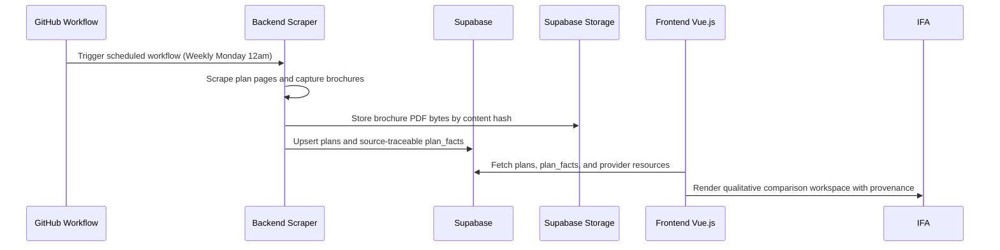
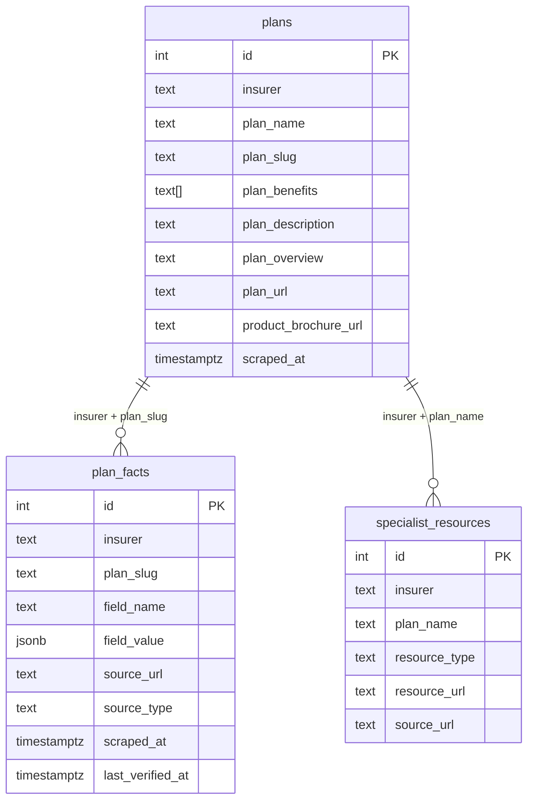

# `Be-sure-ance`

`Be-sure-ance` is an IFA pre-meeting research tool for source-traceable qualitative metadata on Singapore insurance plans. [`compareFIRST`](https://www.comparefirst.sg/wap/homeEvent.action) remains the reference point for regulated quantitative life-insurance comparison; this project complements it with plan-grain qualitative facts that compareFIRST does not try to curate, such as panel/network clues, exclusions, claim process text, and brochure provenance.

The app does not provide financial advice, insurance advice, quotes, recommendations, suitability rankings, premium estimates, or cost projections. It is a research workspace for checking source-linked plan facts before using carrier documents, compareFIRST, or licensed advisory workflows.

## Usage

No production deployment is claimed during Phases 1-4. Phase 5 is the launch gate for restoring Netlify or moving to another static host.

Sites are scraped weekly on [SGT Monday 12am](./.github/workflows/scrape-to-supabase.yml).

> [!IMPORTANT]
> Read the [compliance posture](./docs/COMPLIANCE.md) and [legal disclaimer](#legal-disclaimer) before using `Be-sure-ance`.

## Environment variables

Use [`.env.example`](./.env.example) as the local template.

Frontend variables are public and are bundled into the Vue app:

```sh
VITE_SUPABASE_URL=
VITE_SUPABASE_ANON_KEY=
```

Scraper/backend variables are private and must stay in local `.env` or GitHub Actions secrets:

```sh
SUPABASE_URL=
SUPABASE_SECRET_KEY=
BROCHURE_STORAGE_BUCKET=plan-brochures
# or legacy fallback:
SUPABASE_SERVICE_ROLE_KEY=
```

Netlify only needs the public frontend variables: `VITE_SUPABASE_URL` and `VITE_SUPABASE_ANON_KEY`.

GitHub Actions requires `SUPABASE_URL` and exactly one server-side writer key: `SUPABASE_SECRET_KEY` preferred, or legacy `SUPABASE_SERVICE_ROLE_KEY`. It uses `BROCHURE_STORAGE_BUCKET` when set, defaulting to `plan-brochures`. Never expose `SUPABASE_SECRET_KEY` or `SUPABASE_SERVICE_ROLE_KEY` through `VITE_*` variables.

## Local checks

```sh
pip install -r requirements.txt
black --check src tests
ruff check src tests
python -m unittest discover -s tests -p "test_*.py"
npm --prefix src/be-sure-ance-app ci
npm --prefix src/be-sure-ance-app run lint
npm --prefix src/be-sure-ance-app run format:check
(cd src/be-sure-ance-app && VITE_SUPABASE_URL=https://example.supabase.co VITE_SUPABASE_ANON_KEY=anon npm run build)
pre-commit run --all-files
```

## Screenshots

<div style="display: flex; justify-content: space-between;">
  
  
</div>
<br>
<div style="display: flex; justify-content: space-between;">
  
  
</div>
<br>
<div style="display: flex; justify-content: space-between;">
  
  
</div>

## Architecture

### Stack

* [Frontend](./src/be-sure-ance-app/) - Vue 3, Vite, Supabase JS client.
* [Backend](./src/scrapers/) - Python scrapers, brochure capture/parsing, GitHub Actions.
* [Database](./src/lib/create.sql) - Supabase Postgres with public read-only access and service-role writes.
* [Storage](./src/backend/helper.py) - Supabase Storage for captured brochure PDFs.

### Overview


```mermaid
sequenceDiagram
    participant GitHub Workflow
    participant Backend Scraper
    participant Supabase
    participant Supabase Storage
    participant Frontend Vue.js
    participant IFA

    GitHub Workflow->>Backend Scraper: Trigger scheduled workflow (Weekly Monday 12am)
    Backend Scraper->>Backend Scraper: Scrape plan pages and capture brochures
    Backend Scraper->>Supabase Storage: Store brochure PDF bytes by content hash
    Backend Scraper->>Supabase: Upsert plans and source-traceable plan_facts
    Frontend Vue.js->>Supabase: Fetch plans, plan_facts, and provider resources
    Frontend Vue.js->>IFA: Render qualitative comparison workspace with provenance
```

### DB


```mermaid
erDiagram
    plans {
        int id PK
        text insurer
        text plan_name
        text plan_slug
        text[] plan_benefits
        text plan_description
        text plan_overview
        text plan_url
        text product_brochure_url
        timestamptz scraped_at
    }

    plan_facts {
        int id PK
        text insurer
        text plan_slug
        text field_name
        jsonb field_value
        text source_url
        text source_type
        timestamptz scraped_at
        timestamptz last_verified_at
    }

    specialist_resources {
        int id PK
        text insurer
        text plan_name
        text resource_type
        text resource_url
        text source_url
    }

    plans ||--o{ plan_facts : "insurer + plan_slug"
    plans ||--o{ specialist_resources : "insurer + plan_name"
```

`plans` is the canonical plan catalog. `plan_facts` is the canonical qualitative fact table; each displayed fact carries `source_url`, `source_type`, `scraped_at`, and `last_verified_at`. `plan_comparison_facts` remains an interim qualitative summary table while the frontend completes the Phase 2 migration.

## Details

`Be-sure-ance` only schedules supported scrapers by default. Generic scrapers are experimental, opt-in via `python -m src.scrapers.run_all --include-experimental --only <module>`, and deferred until Phase 2 golden-output tests exist.

| Provider | Runtime status | Decision |
| :--- | :--- | :--- |
| [AIA Singapore Pte Ltd](https://www.aia.com.sg/en/index) | Supported - scheduled | Implemented 08/03/2025 |
| [China Life Insurance (Singapore) Pte Ltd](https://www.chinalife.com.sg/) | Supported - scheduled | Implemented 12/03/2025 |
| [Chubb Singapore Pte Ltd](https://www.chubb.com/sg-en/) | Supported - scheduled | Implemented 13/03/2025 |
| [Great Eastern Life Assurance Co Ltd](https://www.greateasternlife.com/sg/en/about-us.html) | Supported - scheduled | Implemented 15/03/2025 |
| [HSBC Life (Singapore) Pte Ltd](https://www.insurance.hsbc.com.sg/) | Supported - scheduled | Implemented 15/03/2025 |
| [India International Insurance Pte Ltd](https://www.iii.com.sg/) | Supported - scheduled | Implemented 15/03/2025 |
| [Singapore Life Ltd](https://singlife.com/en) | Supported - scheduled | Implemented 13/03/2025 |
| [Sun Life Assurance Company of Canada Singapore Branch](https://www.sunlife.com.sg/en/) | Supported - scheduled | Implemented 13/03/2025 |
| [Tokio Marine Insurance (Singapore) Pte Ltd](https://www.tokiomarine.com/sg/en.html) | Supported - scheduled | Implemented 13/03/2025 |
| [United Overseas Insurance Pte Ltd](https://www.uoi.com.sg/index.page) | Supported - scheduled | Implemented 08/03/2025 |
| [Allianz Insurance (Singapore) Pte Ltd](https://www.allianz.sg/) | Experimental - opt-in only | Defer until Phase 2 golden scraper coverage |
| [China Taiping Insurance (Singapore) Pte Ltd](https://www.sg.cntaiping.com/en/) | Experimental - opt-in only | Defer until Phase 2 golden scraper coverage |
| [FWD Singapore Pte Ltd](https://www.fwd.com.sg/) | Experimental - opt-in only | Defer until Phase 2 golden scraper coverage |
| [Manulife (Singapore) Pte Ltd](https://www.manulife.com.sg/) | Experimental - opt-in only | Defer until Phase 2 golden scraper coverage |
| [Prudential Assurance Company (Singapore) Pte Ltd](https://www.prudential.com.sg/) | Experimental - opt-in only | Defer until Phase 2 golden scraper coverage |
| [Raffles Health Insurance Pte Ltd](https://www.raffleshealthinsurance.com/) | Experimental - opt-in only | Defer until Phase 2 golden scraper coverage |
| [Allied World Assurance Company Pte Ltd (Singapore)](https://alliedworldinsurance.com/singapore/) | Experimental - opt-in only | Defer until Phase 2 golden scraper coverage |
| [AIG Singapore](https://www.aig.sg/home) | Experimental - opt-in only | Defer until Phase 2 golden scraper coverage |
| [ERGO Insurance Pte Ltd](https://www.ergo.com.sg/) | Experimental - opt-in only | Defer until Phase 2 golden scraper coverage |
| [Etiqa Insurance Pte Ltd](https://www.etiqa.com.sg/) | Experimental - opt-in only | Defer until Phase 2 golden scraper coverage |
| [HL Assurance Pte Ltd](https://www.hlas.com.sg/) | Experimental - opt-in only | Defer until Phase 2 golden scraper coverage |
| [Income Insurance Pte Ltd](https://www.income.com.sg/) | Experimental - opt-in only | Defer until Phase 2 golden scraper coverage |
| [Liberty Insurance Pte Ltd](https://www.libertyinsurance.com.sg/) | Experimental - opt-in only | Defer until Phase 2 golden scraper coverage |
| [Lonpac Insurance Bhd](https://www.lonpac.com/) | Experimental - opt-in only | Defer until Phase 2 golden scraper coverage |
| [QBE Insurance (Singapore) Pte Ltd](https://www.qbe.com/sg) | Experimental - opt-in only | Defer until Phase 2 golden scraper coverage |
| [Sompo Insurance (Singapore) Pte Ltd](https://www.sompo.com.sg/) | Experimental - opt-in only | Defer until Phase 2 golden scraper coverage |
| [Direct Asia Insurance (Singapore) Pte Ltd](https://www.directasia.com/) | Experimental - opt-in only | Defer until Phase 2 golden scraper coverage |

## Issues

Report any issues to [gabrielzmong@gmail.com](mailto:gabrielzmong@gmail.com).

## Legal disclaimer

### For Informational Purposes Only

The information provided on Be-sure-ance is for informational research only. While the project records source URLs and verification dates for qualitative plan facts, Be-sure-ance makes no guarantees, representations, or warranties of any kind, express or implied, about completeness, accuracy, reliability, suitability, or availability. Users should independently verify every fact against the carrier source, compareFIRST where applicable, and their own advisory or compliance workflow.

### No Professional Advice

Be-sure-ance does not provide professional, legal, financial, or insurance advice. It does not generate quotes, premiums, cost projections, suitability rankings, recommendations, or purchase pathways. The content displayed is not a substitute for licensed financial advisory work, carrier documents, or regulated comparison tools.

### No Endorsement

The inclusion of any insurance plans or companies on Be-sure-ance does not constitute an endorsement, ranking, or recommendation of their services. Be-sure-ance is not affiliated with any of the listed insurance providers unless explicitly stated otherwise.

### Third-Party Content

Be-sure-ance may display information sourced from third-party providers or link to external websites. We do not control, monitor, or guarantee the accuracy or reliability of such third-party content. Accessing third-party links is at your own risk, and Be-sure-ance is not responsible for any content, claims, or damages resulting from their use.

### Use at Your Own Risk

Users access and use Be-sure-ance at their own risk. Be-sure-ance disclaims all liability for any loss or damage, direct or indirect, arising from reliance on the information provided on this platform. This includes but is not limited to financial loss, data inaccuracies, or decisions made based on the content displayed.

### Limitation of Liability

To the fullest extent permitted by law -

* Be-sure-ance shall not be liable for any direct, indirect, incidental, consequential, or punitive damages arising out of your use of this web app.
* Be-sure-ance disclaims all liability for errors or omissions in the content provided.
* Our total liability under any circumstances shall not exceed the amount paid by you *(if any)* for using Be-sure-ance.

### Changes to Content

Be-sure-ance reserves the right to modify, update, or remove any content on this platform at any time without prior notice. Insurance plans and details may change without notice; users should contact the respective insurance companies for up-to-date information.

### Jurisdiction

This disclaimer and your use of Be-sure-ance shall be governed by and construed in accordance with the laws of Singapore. Any disputes arising out of or in connection with this disclaimer shall be subject to the exclusive jurisdiction of the courts in Singapore.
